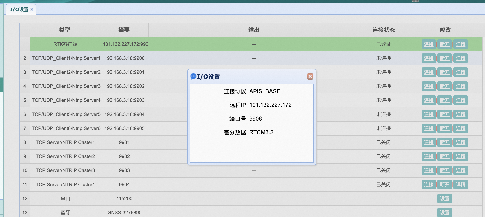
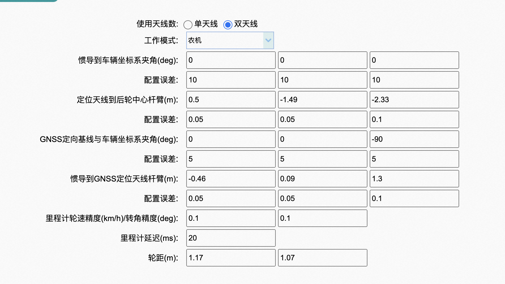

[data format](http://aprs.gids.nl/nmea/)


# 华测RTK


注意看说明书

1. 带基站

```
1.基站先配置成基站模式，网络协议选择APIS
2.用电脑连接移动站（410）的WIFI，进入配置网页
3.请参照用户手册“3.2.1.内置 4G 登录差分配置”这一章节，配置差分数据，其中，在连接协议的时候选择APIS_rover  ，然后输入基站所配置的IP，端口号这些信息，即可连接
4.根据“3.3.惯导设置”描述的，配置410的相关参数和数据输出
```


- 基站 192.168.1.1  (admin / password)


首先看网络设置，sim卡状态是否为连接（正在拨号说明有问题）

然后看IO设置

<p align="center"><br></p>


- 惯导 192.168.200.1


测量外参：

<p align="center"><br></p>


2. 不带基站（wyk）


# can


```bash
pip install canlib
```

**Install libcanlib.so**

Download link: [Kvaser LINUX Driver and SDK Download](https://www.kvaser.com/downloads-kvaser/?utm_source=software&utm_ean=7330130980754&utm_status=latest) or [Intranet Download](http://10.12.120.70:5000/d/f/724877724816028007)
```bash
pip install canlib
tar zxvf linuxcan.tar.gz
cd linuxcan
make -j16
sudo make install
```

**Test canlib**
```bash
python driver/check_can.py
```

If not working, go to ```linuxcan```, unplug the device, and reinstall again
```bash
make -j16
sudo make install
```
or check ```Secure Boot in BIOS is disable```


